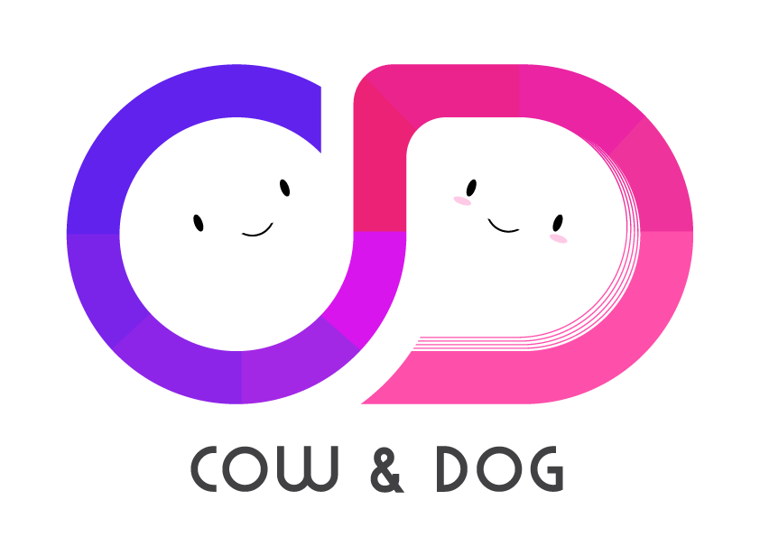

# 🐂🐕COW & DOG



<div>

<p align="center">
  <br/><b>소개팅 서비스</b>
  <p align="center">
 
 
 
 
 
 
 
  </p>
<br/>  
<br/> 
</p>    
</div>

> 서비스명: CowDog
> 팀명: 5xy
> 개발 기간: 2021.07.12 ~ 2021.08.20 (약 7주) 
## 📑 배포주소

>[배포주소](i5b104.p.ssafy.io)

## 📑 문서 

> [기획문서](https://www.notion.so/1-1e3462cc2d1247918beef6ec804b1df5)


## 📑 활용 API(임시)

**Face Filter**

jeeliz(JavaScript) https://github.com/jeeliz/jeelizFaceFilter

snow web filter(JavaScript) https://github.com/doublejbs/snow-web-filter

kairess(Python) https://github.com/kairess/face_detector

kairess 가이드 영상 https://www.youtube.com/watch?v=tpWVyJqehG4

스냅챗필터(Python) https://github.com/oflynned/Snapchat-Filter

스냅챗 문서 url https://syzible.com/snapchat-filters.pdf

ASCII virtual webcam(Python) https://github.com/diegovazquez/ASCIILinuxVirtualWebCam

banuba(상업용?) https://www.banuba.com/facear-sdk/face-filters


**Voice Filter**

https://github.com/funcwj/voice-filter


## 👨 팀원 역할   
| 이름   | 역할 | 내용                        |
| ------ | ---- | --------------------------- |
| 김정운 | 팀장 | 백엔드, 기획 담당자 |
| 오웅식 | 팀원 | 백엔드, 테크리더       |
| 배현우 | 팀원 | 백엔드, QA |
| 조웅현 | 팀원 | 프론트엔드, QA, 프론트엔드 테크리더 |
| 유성호 | 팀원 | 프론트엔드, 기획 담당자 |


 


## 📑 Gantt Chart
   ```mermaid
   gantt
   dateFormat  YYYY-MM-DD
   title       5xy 공통 프로젝트(cowdog)
   excludes    weekends
   
   section 프로젝트 기획
   주제 선정       :done, sub1, 2021-07-12, 5d
   Jira, Git 생성 :done, sub2, 2021-07-19, 2h
   명세서 작성 :active, sub3, 2021-07-15, 2021-07-20
   Jira issue 생성: active, sub4, 2021-07-20, 2d
   
   section 설계
   DB 설계 : sub1, 2021-07-23, 2021-07-24
   와이어 프레임 설계 : 2021-07-20, 2021-07-22
   시퀀스 설계: 2021-07-20, 2021-07-22
   
   section 회원 관련 구현(김정운)
   회원 가입 : sub1, 2021-07-24, 2021-07-27
   마이페이지 : sub2, 2021-07-24, 2021-07-27
   회원 탈퇴 :sub3, 2021-07-25, 2021-07-26
   회원정보 수정 :sub4, 2021-07-25, 2021-07-26
   로그인 :sub5, 2021-07-27, 2021-07-30
   로그아웃 :sub6, 2021-07-25, 2021-07-26
   비밀번호 찾기 :sub7, 2021-07-25, 2021-07-26
   
   section 게시판(조웅현)
   게시판 글 등록:sub1, 2021-07-26, 2021-07-27
   게시판 글 삭제:sub2, 2021-07-27, 2021-07-28
   게시판 글 수정:sub3, 2021-07-28, 2021-07-29
   
   section 관리자 기능(유성호)
   공지사항 :sub1, 2021-07-25, 2021-07-26
   신고:sub2, 2021-07-25, 2021-07-27
   
   section 게임(유성호)
   A or B 게임 :sub1, 2021-08-01, 2021-08-05
   캐치마인드 :sub2, 2021-08-05, 2021-08-17
   
   section webRTC(오웅식, 배현우)
   사전 공부 및 예제 실습 : sub1, 2021-07-24, 2021-07-25
   RTC 통신 구조 설계 :sub2, 2021-07-26, 2021-07-27
   RTC 1:1 통신 구현 : sub3, 2021-07-28, 2021-07-30
   얼굴 필터링 기능 :sub4, 2021-08-17, 2021-08-18
   목소리 변조 기능 :sub5, 2021-08-17, 2021-08-18
   
   section 채팅(오웅식, 배현우, 김정운)
   채팅기능 :sub1, 2021-08-01, 2021-08-05
   
   section 부가기능(오,배,김)
   좋아요 팔로우 :sub1, 2021-08-06, 2021-08-08
   알림 기능 :sub2, 2021-08-09, 2021-08-12
   DM :sub3, 2021-08-13, 2021-08-16
   
   section 매칭(조웅현, 오웅식)
   오늘의 추천:sub1, 2021-07-31, 2021-08-20
   지역 추천:sub2, 2021-07-31, 2021-08-10
   맞춤 추천:sub3, 2021-08-11, 2021-08-15
   
   section UCC
   UCC 제작: sub1, 2021-08-19, 2021-08-20
   ```


## 📑 서비스 개요      
  현대인은 '새로운 만남'에 대해 상당수가 긍정적인 시각을 가지고 있다. 코로나 이전 시기에도 다양한 소모임, 소셜데이팅 앱이 출시되면서 새로운 만남을 가지는 방법이 달라지고 있었고, 국내외 다양한 앱(틴더, 글램, 위피 등)들이 입지를 높여가고 있었다. 2019년 [트렌드모니터의 조사 결과](https://www.trendmonitor.co.kr/tmweb/trend/allTrend/detail.do?bIdx=1756&code=0401&trendType=CKOREA)에 따르면 조사 대상자의 과반 이상이 향후 사교 어플 이용 의향을 가지고 있다고 응답하였고, 핵심 이유는 순서대로 다음과 같았다.

- 반복적이고 일상적인 영역에서 벗어나 새로운 사람을 만날 수 있어서
- 나의 인맥을 넓히고 싶어서
- 주변에 나의 관심사를 공유할 사람이 없어서
- 연애까지도 할 수 있는 특별한 상대를 만나고 싶어서

반면에 이러한 사교 어플 혹은 소개팅 어플에 대한 부정적인 인식 또한 존재하고, 구체적으로는 다음과 같다.

- 불건전한 목적으로 소개팅 앱을 이용하는 사람들이 많을 것 같다.
- 소개팅 앱으로 만나는 상대는 어딘가 신뢰가 가지 않을 것 같다.


  코로나 이후 오프라인 만남의 기회가 줄어들자 자연스레 온라인 만남을 추구하는 사람이 많아져 데이팅앱 사용자가 전년에 비해 55% 증가하였고, 21년 3월 기준으로 앱스토어 매출 상위 25위 중 11개의 앱이 상위권을 차지하고 있다고 한다(8월 현재 10개 앱이 상위권에 위치). 앞서 이야기한 부정적인 인식을 해소하기 위한 방법으로 보다 안전하고 믿을만한 상대를 소개시켜주는 서비스 앱(연고링, 스카이피플, ...)이 등장하여 인기를 끌기도 하였다. 이에 따라 소개팅앱에 대한 사람들의 인식 또한 다소 개선되고 있다.


  Cow & Dog는 기본적으로 다른 소개팅 어플과 마찬가지로 매칭 및 화상 채팅을 주요 기능으로 제공하며, 특히 자신이 원하는 조건에 해당하는 상대를 매칭해주는 기능을 제공하여 새로운 만남에서 자연스럽게 같은 취향이나 성향을 공유할 수 있는 상황을 만들어낸다. 이에 더해, 간단하지만 재미있는 대화 소재가 될 수 있는 A or B 선택 게임이나, 그림을 통해 주제를 맞추는 캐치마인드를 부가 기능으로 제공하여  첫 만남의 어색함을 풀고 아이스브레이킹을 할 수 있도록 하였다. 

  실제 사용되는 앱이 된다면 가입에 보다 엄격한 기준과 인증 절차, 중복 가입 방지 제한을 두어 신뢰성을 확보해야 하겠지만, 일단은 이러한 제한 없이 다양한 정보 입력으로 가입할 수 있으며, 대신 신고 기능을 통해 불건전한 목적의 사용자를 걸러낼 수 있도록 하고 있다.

  이 어플리케이션은 다음과 같은 성향의 사람들이 사용하면 좋을 것이다.

- 같은 취향의 사람을 만나고 싶은 사람
- 첫 만남이 어색하여 어쩔 줄 모르는 사람
- 말주변이 없는 사람

거리나 취향, 혹은 랜덤으로 다양한 사람을 만나고 게임을 통해 친해져보는 기회를 가져보자.


**참고자료**

['새로운 만남'도 '연애'도 스마트폰 앱에서 찾는 현대인들](https://www.trendmonitor.co.kr/tmweb/trend/allTrend/detail.do?bIdx=1756&code=0401&trendType=CKOREA)

[[중앙일보] 사용자 55% 늘었다, 데이팅앱이 코로나 학번들 연애 놀이터](https://news.joins.com/article/24010214)

## 📑 주요 기능     
- 거리별 매칭, 맞춤 매칭, 랜덤 매칭 기능
  - 거리별 매칭 - 2km ,4km, 6km, 8km, 10km 반경 이내의 이성을 확인할 수 있음
  - 맞춤 매칭 - 취미, 주량, MBTI, 종교 등 회원가입시 등록한 다양한 조건 중 본인이 원하는 조건에 맞는 이성을 매칭
  - 랜덤 매칭 - 이성, 동성 구분 없이 랜덤으로 매칭
- 다양한 부가 기능을 가진 화상 채팅
  - 매칭 화면에 나온 대상 혹은 나를 팔로우, 맞팔로우 한 사람에게 화상 채팅 요청을 보낼 수 있음
  - 부가 기능1. 목소리 변조
  - 부가 기능2. A or B 게임
  - 부가 기능3. 캐치마인드
  - 부가 기능4. 얼굴 필터(오작동)
- 화상 만남 이후 마음에 든 상대방을 팔로우 할 수 있음
- 맞팔로우 상태인 상대방에게는 DM 기능 활성화
- 마이페이지에서 나를 팔로우 한 사람, 맞팔로우 상태인 사람 확인 가능, DM 가능
- 게시글을 통해 자신의 생각을 태그와 함께 공유!
  - 댓글을 통해 의견을 나눌 수 있음
- 화상 채팅중인 대상을 신고할 수 있음
  - 관리 페이지에 즉시 반영, 관리자가 확인 후 유저 정지 가능
- 게시글을 신고할 수 있음
  - 관리 페이지에 즉시 반영, 관리자가 확인 후 게시글 삭제 가능


## 📑 실행방법 
### ✔ 포트번호    

```
프론트 : 3000 -> 8000
백 : 8080
DB : 3306
Jenkins : 9090
```


### ✔ 실행순서

미정


## 📑 규칙

### ✔ 브랜드 컬러 & 폰트

**브랜드 컬러:** White, <span style="color:#FF4E7E">#FF4E7E</span>, <span style="color:#323545">#323545</span> (핑크와 다크 그레이) + #f0f2f5(연회색, 배경 테마)

**폰트:** 서울남산체


### ✔ Branch 규칙  
```bash
develop - feature/기능명/fe or be       
```


### ✔ Code Style
| FrontEnd   | BackEnd |
| ------ | ---- |
| 1. 폴더명: 첫글자 대문자→ ex) Feed/Add.vue<br />2. 파일명: 첫글자 대문자  → ex) Add.vue <br/>3. 경로명: 소문자 → ex) /add | 1. 클래스명:  첫글자 대문자 + camel case <br/> ex) MainController.java <br/><br/> 2. 함수, 변수: 첫글자 소문자 + camel case <br/> ex) public void setUserName(); |
|- ☑ 프론트엔드 규칙||
    - 플러그인 : Element Plus 사용
    - 공통파일 수정 시 팀채널에 공유하기 


- ☑ 백엔드 명명규칙 
    - [참고](https://velog.io/@aidenshin/Java-%EC%9E%90%EB%B0%94-%EC%BD%94%EB%94%A9-%EA%B7%9C%EC%B9%99-Java-Code-Conventions#%EB%AA%85%EB%AA%85naming-%EA%B7%9C%EC%B9%99)  


- if문
    - 한줄 일 때, Block 처리하기
    - else if / else /중괄호는 조건문 바로 옆에 붙이기

    ```java
    if(condition){
     statement;
    } else if(condition2){
     statement2;
    } else{
     statement3;
    }
    ```

- for
  
    - 단순 반복문은 iterator를 i,j,k,...,z순으로 명명하기
- 주석 상대방이 이해할 수 있도록 달기
    - /**/ 설명 여러줄 필요할 때 코드 위에 작성
    - // 간단한 주석 코드 옆에 작성


### ✔ commit 규칙    

📌 하나의 기능 완성되면 한번에 커밋

```
git commit -m "{지라이슈번호} 작업커밋내용"
git commit -m "S04P22B107-56 AWS RDS, S3 서버 및 기본환경 세팅"

**프론트** : "{지라이슈번호} 완성한 기능(작업내용)" 
		ex) S04P22B107-56 피드작성 컴포넌트 추가/수정/삭제

**백** : "{지라이슈번호} 완성한 기능(작업내용)" 
		ex) S04P22B107-56 피드작성 컴포넌트 추가/수정/삭제

**리드미** : "README_날짜: 수정한 부분" 
		ex) S04P22B107-56_ [feat] : README_0118: 와이어프레임 수정

```


## 📑산출물  

>[산출물 바로가기](https://github.com/rlawjddns0/PJT1/tree/master/%EC%82%B0%EC%B6%9C%EB%AC%BC)


### ✔ 와이어프레임    
> [피그마 바로가기](https://www.figma.com/file/DgYRBtDjlOecYPiEZOxTAi/Untitled?node-id=0%3A1)    


### ✔ 시연영상
>[시연영상 바로가기](https://drive.google.com/file/d/14IUhTvacFWeBHm58DxcCfhPjhyyYzGwp/view)


